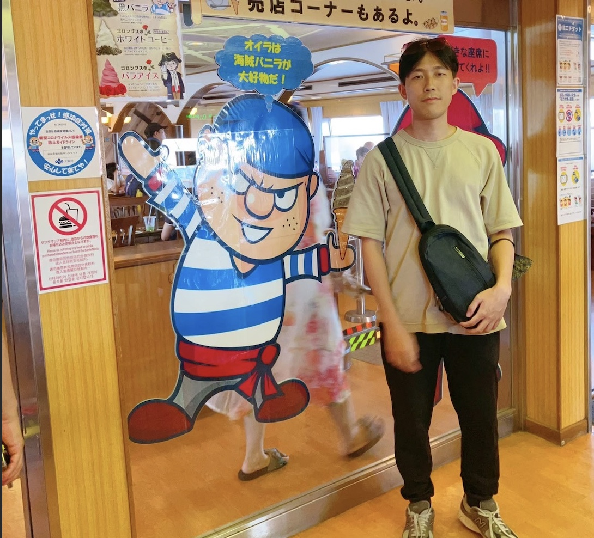
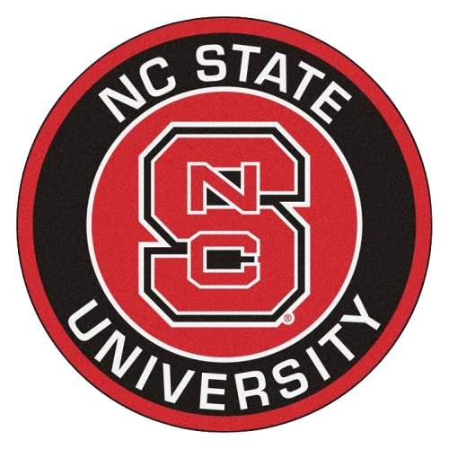
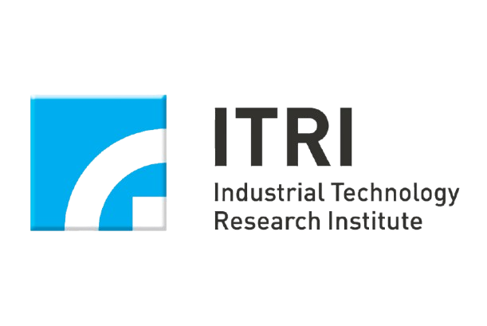
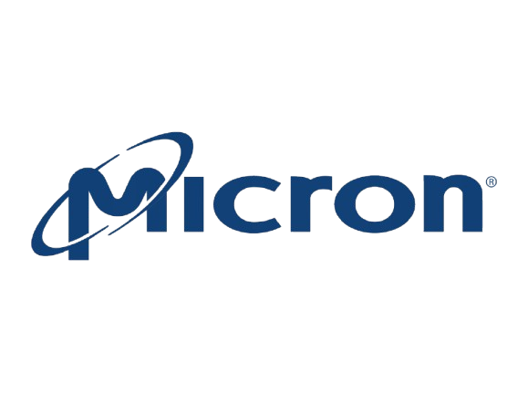

# About me

- **Name：** Leslie Liu
- **Major：** NUSU MCS 26 Spring Grad
- **Contact me：** [s9172051212@gmail.com](mailto:s9172051212@gmail.com)

For more detail about me: [My resume](https://drive.google.com/drive/folders/1c9TB_iGpKQIuBhPy9GeznBRWCzmMFXTM?usp=sharing)。

<section id="timeline">
  <h2>Education and Work Experience</h2>
  

    <!-- 第一個時間點 -->
    

      

      

        

        
        

        2024 - Now
        <h3>North Carolina State University - Master of Computer Science</h3>
        

      

    

    <!-- 第2個時間點 -->
    

      

      

        

        
        

        2023 - 2024
        <h3>ITRI (Industrial Technology Research Institute) - AI Researcher</h3>
        

        • Collaborate with academia and industry to accelerate materials research through machine learning.
        

        

        • Develop and optimize processes, design app interfaces, and promote them to chemical companies.
        

        

        • Design app interfaces and promote them to chemical companies with relevant needs.
        

      

    
  

    <!-- 第3個時間點 -->
    

      

      

        

        
        

        2021 - 2023
        <h3>Micron - Process Engineer</h3>
        
• Evaluation of product process maturity (controller thin film qualification)

        
• Developed RPA solutions integrated with machine learning tools to enhance product quality and automate defect detection. 

      

    
  

    <!-- 第4個時間點 -->
    

      

      

        

        
        

        2019 - 2021
        <h3>NTHU - Master of Chemical Engineering</h3>
        
• Presented the resulting data in a professional manuscript using Python libraries.

        
• Published research paper“Process Modeling With Small Data Integration via Deep Convolutional Autoencoder-based Embedding Model ”

      

    
  

    <!-- 第5個時間點 -->
    

      

      

        

        
        

        2018 - 2019
        <h3>Military Service</h3>
        

      

    
  

 

    <!-- 第6個時間點 -->
    

      

      

        

        
        

        2014 - 2018
        <h3>NTHU - Bachelor of Chemical Engineering</h3>
        

      

    
  
    <!-- 可以依需求繼續新增 timeline-block -->
  

</section>
